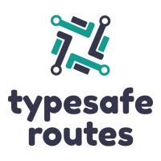

# Typesafe Routes

Enhance your preferred routing library by incorporating type-safety into string-based route definitions. Allow TypeScript to identify broken links during the compilation process, enabling you to develop easily maintainable software.

This utility can be utilized with any framework that adheres to the [path-to-regex](https://github.com/pillarjs/path-to-regexp) syntax (however, only a portion of it is supported). Example applications using [react-router](https://reacttraining.com/react-router/) or [express](https://expressjs.com/) can be found in the `src/demo` directory.

**Typesafe Routes utilizes [Template Literal Types](https://devblogs.microsoft.com/typescript/announcing-typescript-4-1-beta/#template-literal-types) and [Recursive Conditional Types](https://devblogs.microsoft.com/typescript/announcing-typescript-4-1-beta/#recursive-conditional-types). These features are only available in [typescript version 4.1](https://github.com/microsoft/TypeScript/issues/40124) and above.**

## Installation (npm/yarn examples)

``` sh
npm i typesafe-routes

# or

yarn add typesafe-routes
```

## Usage


### `route(path: string, parserMap: Record<string, Parser>, children: Record<string, ChildRoute>)`

* `path` the path following the `path-to-regex` syntax.
* `parserMap` contains parameter-specific `Parser` identified by parameter name
* `children` assigns route children for nested routes

## Examples

<details>
  <summary>Basic Example</summary>

  ``` ts
  import { route, stringParser } from "typesafe-routes";

  const accountRoute = route("/account/:accountId", {
    accountId: stringParser, // parser implicitly defines the type (string) of 'accountId'
  }, {});

  // serialisation:
  accountRoute({ accountId: "5c9f1e79e96c" }).$
  // => "/account/5c9f1e79e96c"

  // parsing:
  accountRoute.parseParams({ accountId: "123"}).$
  // => { accountId: "123" }
  ```

  The `stringParser` is likely the most widely used parser/serializer, however, the module also includes `intParser`, `floatParser`, `dateParser`, and `booleanParser`. You are not restricted to these options and can implement your own custom parser/serializer by following the `Parser<T>` interface. More information on this topic can be found further down the page.
</details>

<details>
  <summary>Nested Routes</summary>
  
  ``` ts
  import { route } from "typesafe-routes";

  const detailsRoute = route("details", {}, {})
  const settingsRoute = route("settings", {}, { detailsRoute });
  const accountRoute = route("/account", {}, { settingsRoute });

  accountRoute({}).settingsRoute({}).detailsRoute({}).$
  // => "/account/settings/details"
  ```
</details>

<details>
  <summary>Absolute & Relative Routes</summary>

  ``` ts
  import { route } from "typesafe-routes";

  const invoice = route(":invoiceId", { invoiceId: intParser }, {});

  const invoices = route("invoices", {}, { invoice });

  const sales = route("sales", {}, { invoices });

  const home = route("/", {}, { sales }); // root route prefixed with a "/"

  // absolute routes:
  home({}).sales({}).invoices({}).invoice({invoiceId: 1234}).$ // => "/sales/invoices/1234"
  home({}).sales({}).invoices({}).$ // => "/sales/invoices"
  home({}).sales({}).$ // => "/sales"
  home({}).$ // => "/"

  // relative routes
  sales({}).invoices({}).invoice({invoiceId: 5678}).$ // => "sales/invoices/5678"
  invoices({}).invoice({invoiceId: 8765}).$ // => "invoices/8765"
  invoice({invoiceId: 4321}).$ // => "4321"

  ```
</details>

<details>
  <summary>Optional Parameters</summary>

  Parameters can be suffixed with a question mark (?) to make a parameter optional.

  ``` ts
  import { route, intParser } from "typesafe-routes";

  const userRoute = route("/user/:userId/:groupId?", {
    userId: intParser,
    groupId: intParser // parser is required also required for optional parameters
  }, {});

  userRoute({ userId: 342 }).$ // groupId is optional
  // => "/user/342"
  userRoute({ userId: 5453, groupId: 5464 }).$
  // => "/user/5453/5464"
  userRoute({ groupId: 464 }).$
  // => error because userId is missing

  // parsing:
  userRoute.parseParams({ userId: "65", groupId: "212" });
  // returns { userId: 6, groupId: 12 }
  ```

</details>

<details>
  <summary>Query Parameters</summary>

  Parameters can be prefixed with `&` to make the parameter a query parameter.

  ``` ts
  import { route, intParser } from "typesafe-routes";

  const usersRoute = route("/users&:start&:limit", {
    start: intParser,
    limit: intParser,
  }, {});

  usersRoute({ start: 10, limit: 20 }).$
  // returns "/users?start=10&limit=20"
  ```

  When serialising nested routes the query params of a parent route are always being appended to the end of the locator string.

  ``` ts
  import { route, intParser } from "typesafe-routes";

  const settingsRoute = route("/settings&:expertMode", {
    expertMode: booleanParser,
  }, {});

  const usersRoute = route("/users&:start&:limit", {
    start: intParser,
    limit: intParser,
  }, {
    settingsRoute
  });

  usersRoute({ start: 10, limit: 20 }).settingsRoute({ expertMode: true })$
  // returns "/users/settings?expertMode=true&start=10&limit=20"

  userRoute.parseParams({ start: "10", limit: "20", expertMode: "false" });
  // returns { start: 10, limit: 20, expertMode: false }
  ```

</details>

<details>
  <summary>Parsers &amp; Serializers</summary>

  If you need to parse/serialize other datatypes than primitive types or dates or the build-in parsers don't meet your requirements for some reason you can create your own parsers with a few lines of code. The `Parser<T>` interface that helps yo to achieve that is defined as followed:

  ``` ts
  interface Parser<T> {
    parse: (s: string) => T;
    serialize: (x: T) => string;
  }
  ```

  The next example shows the implementation and usage of a typesafe `Vector2D` parser/serializer.

  ``` ts
  import { Parser, route } from "typesafe-routes";

  interface Vector2D {
    x: number;
    y: number;
  };

  const vectorParser: Parser<Vector2D> = {
    serialize: (v) => btoa(JSON.stringify(v)),
    parse: (s) => JSON.parse(atob(s)),
  };

  const mapRoute = route("/map&:pos", { pos: vectorParser }, {});

  mapRoute({ pos: { x: 1, y: 0 }}).$;
  // returns "/map?pos=eyJ4IjoxLCJ5IjowfQ%3D%3D"

  vectorParser.parseParams({pos: "eyJ4IjoxLCJ5IjowfQ=="})
  // returns { pos: { x: 1, y: 0 }}
  ```

</details>

<details>
  <summary>React Router Utilities</summary>

  #### `useRouteParams(route: RouteNode)`

  The `useRouteParams` hook relies on the `useParams` hook from the optional dependency `react-router-dom`. Unlike `useParams`, the `useRouteParams` function additionally parses [`query strings`](https://developer.mozilla.org/en-US/docs/Web/API/Location/search) using [`qs`](github.com/ljharb/qs).

  ``` ts
  import { route, useRouteParams } from "typesafe-routes/react-router";

  const topicRoute = route("/:topicId&:limit?", {
    topicId: stringParser,
    limit: floatParser,
  }, {});

  const Component = () => {
    const { topicId, limit } = useRouteParams(topicRoute);

    return <>{...}</>;
  }
  ```

  #### `<Link>` and `<NavLink>`

  Same as the original `<Link>` and `<NavLink>` from `react-router-dom` but require the `to` property to be a route:

  ``` ts
  import { route, Link, NavLink } from "typesafe-routes/react-router";

  const topicRoute = route("/topic", {}, {});

  <Link to={topicRoute({})}>Topic</Link>
  <NavLink to={topicRoute({})}>Topic</NavLink>

  <Link to="/topic">Topic</Link> // error "to" prop can't be string 
  <NavLink to="/topic">Topic</NavLink> // error "to" prop can't be string 
  ```

  #### `template`

  `typesafe-routes` implements a subset of template syntax of `react-router` and thus is compatible with it. But since specifying additional query params would break the compatibility (`react-router` doesn't understand the `&` prefix) the `.template` property doesn't contain any of such parameters and can be used to define router in your `react-router` app:

  ``` ts
  import { route } from "typesafe-routes";

  const topicRoute = route("/:topicId&:limit?", {
    topicId: stringParser,
    limit: floatParser,
  }, {});

  <Route path={topicRoute.template}> // template only contains the "/:topicId" path
    <Topic />
  </Route>
  ```

</details>

---

## Coffee to Code Transpiler

You can make a difference and enhance the quality of this project by not only reporting issues and submitting pull requests, but also by treating me to a fresh cup of coffee as a token of appreciation for my efforts.

<a href="https://www.buymeacoffee.com/kruschid" target="_blank"></a>

## Roadmap

At this point, I believe that this library has all the necessary features and my main focus will be on fixing bugs and refining the API. However, if there is a significant demand for additional functionality or pull requests, I may consider expanding the scope of the project.
